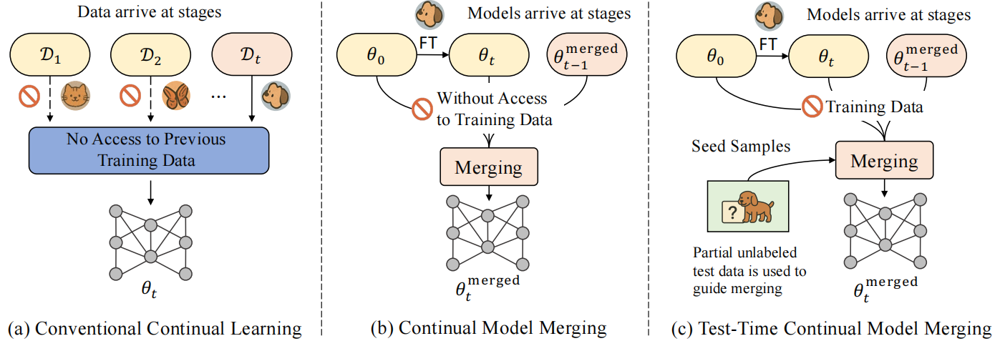

<div align='center'>

# MINGLE: Mixture of Null-Space Gated Low-Rank Experts for Test-Time Continual Model Merging

</div>


This repository contains the PyTorch implementation of the paper:

[MINGLE: Mixture of Null-Space Gated Low-Rank Experts for Test-Time Continual Model Merging (NeurIPS 2025)](https://arxiv.org/pdf/2505.11883)


## Abstract

Continual model merging integrates independently fine-tuned models sequentially without access to the original training data, offering a scalable and efficient solution for continual learning.
However, existing methods face two critical challenges: parameter interference among tasks, which leads to catastrophic forgetting, and limited adaptability to evolving test distributions.
To address these issues, we introduce the task of Test-Time Continual Model Merging (TTCMM), which leverages a small set of unlabeled test samples during inference to alleviate parameter conflicts and handle distribution shifts.
We propose MINGLE, a novel framework for TTCMM. MINGLE employs a mixture-of-experts architecture with parameter-efficient, low-rank experts, which enhances adaptability to evolving test distributions while dynamically merging models to mitigate conflicts.
To further reduce forgetting, we propose Null-Space Constrained Gating, which restricts gating updates to subspaces orthogonal to prior task representations, thereby suppressing activations on old tasks and preserving past knowledge. We further introduce an Adaptive Relaxation Strategy that adjusts constraint strength dynamically based on interference signals observed during test-time adaptation, striking a balance between stability and adaptability.
Extensive experiments on standard continual merging benchmarks demonstrate that MINGLE achieves robust generalization, significantly reduces forgetting, and consistently surpasses previous state-of-the-art methods by 7–9\% on average across diverse task orders.


## Introduction to TTCMM

We introduce a new task: **Test-Time Continual Model Merging (TTCMM)**.

- **Conventional Continual Learning (CL)** trains models sequentially with data arriving in stages, but without access to past task data.  
- **Continual Model Merging (CMM)** continually fuses independently trained models, without using any training data.  
- **TTCMM** improves model merging by leveraging a small number of unlabeled test samples from the current task, enabling better adaptation at test time.

<p align="center">
  
</p>

<p align="center">
Figure: Comparison of three continual learning paradigms.
</p>

## Installation

install the latest version in development

```bash
pip install -e . # install the package in editable mode
```

## Project Structure

The project is structured as follows:

- `fusion_bench/`: the main package of the benchmark.
  - `method`: contains the implementation of the fusion methods.
    > **naming convention**: `fusion_bench/method/{method_name}/{variant}.py` contains the implementation of the specific method or its variants.
      For example, `fusion_bench/method/regmean/clip_regmean.py` contains the implementation of the RegMean algorithm for CLIP vision models.
  - `modelpool`: contains the implementation of the model pool, responsible for managing the models and dataset to be loaded.
  - `taskpool`: contains the implementation of the task pool, responsible for evaluating the performance of models returned by the algorithm.
- `config/`: configuration files for the benchmark. We use [Hydra](https://hydra.cc/) to manage the configurations.
  - `method`: configuration files for the fusion methods.
    > **naming convention**: `config/method/{method_name}/{variant}.yaml` contains the configuration for the specific method or its variants.
  - `modelpool`: configuration files for the model pool.
  - `taskpool`: configuration files for the task pool.
  - `model`: configuration files for the models.
  - `dataset`: configuration files for the datasets.
- `examples/`: example scripts for running some of the experiments.
  > **naming convention**: `examples/{method_name}/` contains the files such as bash scripts and jupyter notebooks for the specific method.

## How to run the experiments

We provide bash scripts to reproduce the results in the paper.  
All scripts are located in the examples/mingle folder.

### Reproducing Tables

- Table 1:
  bash examples/mingle/tab1.sh

- Table 2:
  bash examples/mingle/tab2.sh

- Table 3:
  bash examples/mingle/tab3.sh

- Table 4:
  bash examples/mingle/tab4.sh


## Acknowledgements

This project is based on [FusionBench](https://github.com/tanganke/fusion_bench). We thank the authors for their valuable contribution.

In this repository, we only keep the essential code required to reproduce the results in the **MINGLE** paper.  
For the full benchmark codebase and additional functionalities, please refer to [FusionBench](https://github.com/tanganke/fusion_bench).
## Citation

If you find our work useful, please consider citing:
```
@article{qiu2025mingle,
  title={MINGLE: Mixture of Null-Space Gated Low-Rank Experts for Test-Time Continual Model Merging},
  author={Qiu, Zihuan and Xu, Yi and He, Chiyuan and Meng, Fanman and Xu, Linfeng and Wu, Qingbo and Li, Hongliang},
  journal={arXiv preprint arXiv:2505.11883},
  year={2025}
}
```
